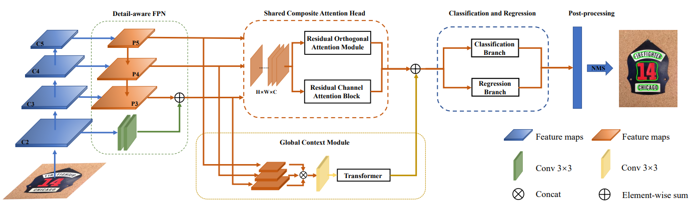

## MS-ROCANET: MULTI-SCALE RESIDUAL ORTHOGONAL-CHANNEL ATTENTION NETWORK FOR SCENE TEXT DETECTION

#### 2022 IEEE International Conference on Acoustics, Speech and Signal Processing (ICASSP)

Jinpeng Liu, Song Wu, Dehong He, Guoqiang Xiao

College of Computer and Information Science, Southwest University, Chongqing, China


## Introduction

Deep neural networks-based scene text detection has obtained increasing attention in recent years. However, the existing scene text detection methods cannot effectively solve the problem of unclear text features. In this paper, a Multi-scale Residual Orthogonal-Channel Attention Network (MS-ROCANet) is proposed to improve the recall and accuracy of scene text detection. Specifically, a Detail-aware FPN is designed to capture more detailed information. Then, a Shared Composite Attention Head (SCAH) consists of a Residual Orthogonal Attention Module (ROAM), and a Residual Channel Attention Block (RCAB) is proposed. It can enhance textual region features at a multi-scale level. Finally, a global context extraction module is proposed to obtain global contextual information after referring to the core idea of Transformer. Extensive experiments demonstrated that our MS-ROCANet achieved competitive results on a variety of baselines for text detection. The codes and models are available at https://github.com/ASentry/MS-ROCANet.

<div align="left">
  
</div>


## Installation

Please refer to [install.md](docs/install.md) for installation.

## Train and Test

### Train

```python
python tools/train.py configs\textdet\msrocanet\msrocanet_r50dcnv2_fpn_1500e_ctw1500.py --work-dir work-dirs/msrocanet/ctw1500 --gpus 1 
```

### Test

```python
python tools/test.py configs\textdet\msrocanet\msrocanet_r50dcnv2_fpn_1500e_ctw1500.py ${CHECKPOINT_FILE} --eval hmean-iou --show-dir result/ctw1500
```

## Result

### CTW1500

|   Method   | Backbone         | Pretrained Model | Training set  |   Test set   | #epochs | Test size   | Recall | Precision | Hmean | model |
| :----:| :----: | :----: | :----:| :----:| :----:| :----:| :----:| :----:| :----:| :----:|
| MS-ROCANET | ResNet50 + DCNv2 | ImageNet | CTW1500 Train | CTW1500 Test | 1500 | (736, 1080) | 0.834 | 0.882 | 0.857 |  [model](https://pan.baidu.com/s/1BNeqyHv56ydqmwjboYvq-Q<br/>提取码：t8nb)|

### ICDAR2015

|   Method   | Backbone         | Pretrained Model | Training set  |   Test set   | #epochs | Test size   | Recall | Precision | Hmean |
| :----:| :----: | :----: | :----:| :----:| :----:| :----:| :----:| :----:| :----:|
| MS-ROCANET | ResNet50 + DCNv2 | ImageNet | ICDAR Train | ICDAR Test | 1500 | (2260, 2260) | 0.832 | 0.898 | 0.864 |

### Total-Text

|   Method   | Backbone         | Pretrained Model | Training set  |   Test set   | #epochs | Test size   | Recall | Precision | Hmean |
| :----:| :----: | :----: | :----:| :----:| :----:| :----:| :----:| :----:| :----:|
| MS-ROCANET | ResNet50 + DCNv2 | ImageNet | Total-Text Train | Total-Text Test | 1500 | (1333, 1333) | 0.833 | 0.856 | 0.845 |

## Citation

If you find this project useful in your research, please consider cite:

```bibtex
@inproceedings{liu2022ms,
  title={MS-ROCANet: Multi-Scale Residual Orthogonal-Channel Attention Network for Scene Text Detection},
  author={Liu, Jinpeng and Wu, Song and He, Dehong and Xiao, Guoqiang},
  booktitle={ICASSP 2022-2022 IEEE International Conference on Acoustics, Speech and Signal Processing (ICASSP)},
  pages={2200--2204},
  year={2022},
  organization={IEEE}
}
```

## Acknowledgement

Our code is developed based on [MMOCR](https://github.com/open-mmlab/mmocr) and FCENet. We thank the awesome work provided by MMOCR and FCENet.
